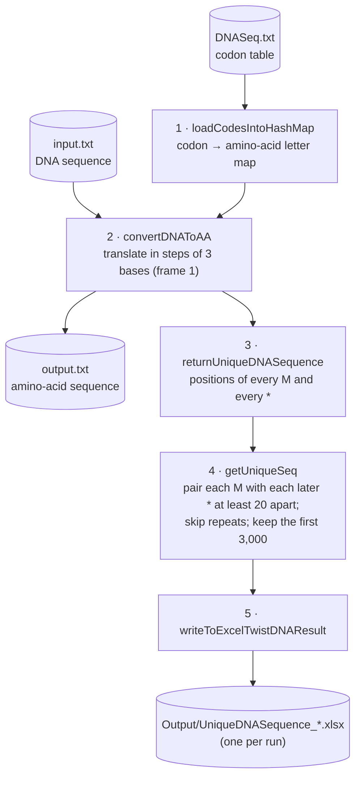

# DNA Sequence Extracting Utility

A Java utility that translates a DNA sequence into amino acids and extracts the protein sequences that run from a start (`M`) to a stop (`*`), writing them to an Excel file. Built in 2020 as a coding exercise for Twist Bioscience.

The sample input (`src/test/resources/input.txt`) is a 29,902-base DNA sequence, the length of the SARS-CoV-2 genome.

## Contents

- [How it works](#how-it-works)
- [Project structure](#project-structure)
- [Running it](#running-it)
- [Configuration](#configuration)
- [Output](#output)
- [Continuous integration](#continuous-integration)
- [Known issues](#known-issues)

## How it works

The program is written as a TestNG class, `twistBioScience.driverClass`, whose five methods run in order (by `priority`) and share state through fields. They are steps of a program, not tests: none of them asserts anything.



1. **Load the codon table.** Each line of `DNASeq.txt` is a letter followed by its codons, e.g. `M:ATG` or `*:TAA:TAG:TGA`. They are loaded into a map from codon to letter.
2. **Translate.** The DNA is read three bases at a time from the first base (reading frame 1), and each codon is replaced by its letter. The result is written to `src/test/resources/output.txt` (9,967 amino acids for the sample input).
3. **Find starts and stops.** The positions of every `M` (start) and `*` (stop) in the amino-acid sequence are recorded.
4. **Extract sequences.** Each `M` is paired with each later `*` that is at least 20 positions away. The amino-acid sequence between them, and the matching stretch of DNA, are kept if they haven't been seen before. Only the first 3,000 are kept (see [Known issues](#known-issues)).
5. **Write Excel.** The kept sequences are written to a new Excel file in `Output/`.

## Project structure

```text
.
├── .github/workflows/build.yml     GitHub Actions: build, run, check and upload the results
├── pom.xml                         Dependencies (TestNG, Apache POI) and build plugins
├── testng.xml                      TestNG suite that runs driverClass
├── config.properties               File paths, result limit, Excel sheet and column names
└── src/test/
    ├── java/twistBioScience/
    │   ├── driverClass.java        The five steps above
    │   ├── commonFunctions.java    File reading and writing helpers, config key names
    │   └── ReadPropertyFile.java   Reads config.properties
    └── resources/
        ├── DNASeq.txt              Codon table
        ├── input.txt               Sample DNA sequence
        └── output.txt              Translated amino-acid sequence (overwritten on every run)
```

## Running it

Requires JDK 8 or newer (CI uses 17) and Maven 3.

```bash
mvn test -Dsurefire.suiteXmlFiles=testng.xml
```

The `-Dsurefire.suiteXmlFiles=testng.xml` part is needed: without it, `mvn test` finds no tests (the class name doesn't end in `Test`) and reports success without running anything. A run takes about 2 minutes and prints the number of sequences found.

In Eclipse or IntelliJ, you can also right-click `testng.xml` and run it as a TestNG suite.

## Configuration

Settings are in `config.properties`. Paths are relative to the project folder, so run from there.

| Setting | Default | Meaning |
|---|---|---|
| `inputFile` | `./src/test/resources/input.txt` | DNA sequence to translate (A, C, G, T only) |
| `dnaSeqFile` | `./src/test/resources/DNASeq.txt` | Codon table |
| `AACodedOutput` | `./src/test/resources/output.txt` | Where the translated amino-acid sequence is written |
| `resultFolder` | `./Output/` | Folder for the Excel file |
| `numberOfResultsToExtract` | `3000` | Maximum number of sequences written to Excel |
| `excelWorkSheetName` | `"TwistBioScience"` | Sheet name (the quotes become part of the name) |
| `column1` to `column4` | `AA-Seq`, `DNA-Seq`, `Strt-Index-DNA-Seq`, `DNA-Length` | Excel column headings |

## Output

Each run creates `Output/UniqueDNASequence_<time>.xlsx` with one row per sequence:

| Column | Contents |
|---|---|
| AA-Seq | Amino-acid sequence from the `M` to the `*` |
| DNA-Seq | The matching DNA (three bases per amino acid) |
| Strt-Index-DNA-Seq | Position of the first DNA base in `input.txt`, counting from 1 |
| DNA-Length | Length of the DNA sequence in bases |

## Continuous integration

`.github/workflows/build.yml` runs on every push and pull request, and on demand from the **Actions** tab:

1. Sets up JDK 17 with a Maven cache.
2. Removes the old result committed in `Output/` and runs `mvn test -Dsurefire.suiteXmlFiles=testng.xml`.
3. Fails unless all five TestNG methods ran and an Excel file was produced, and adds the number of sequences found to the run summary.
4. Uploads the **dna-sequence-results** artifact: the Excel file, `output.txt` and the TestNG reports.

The checks in step 3 only confirm that the program ran. They don't check that its results are correct.

## Known issues

A review in October 2026 against an independent translation with the standard genetic code found the following. None of them is fixed yet.

- **Glutamine (Q) and glutamic acid (E) come out as `Z`.** The `Z:CAA:CAG:GAA:GAG` line in `DNASeq.txt` comes after the `Q` and `E` lines and overwrites them. The sample output has 595 `Z` and no `Q` or `E`; every other position matches the standard code.
- **Sequences can contain stop codons in the middle.** Each `M` is paired with every later `*`, not only the first one after it, so most results span several stops. The sample input gives 27,703 such pairs. Counting only from each `M` to its first stop (an open reading frame) gives 76.
- **The result limit is off by one.** With `numberOfResultsToExtract=3000`, 3,001 rows are written.
- **Only reading frame 1 of one strand is translated.** The other two frames and the reverse strand are not searched.
- **The start index is found with `indexOf`.** It returns the first place the sequence appears, so it would be wrong if the same sequence appeared earlier; for the sample input every row is correct.
- **No assertions.** The TestNG methods are program steps and always pass.
- **`mvn package` builds a jar that doesn't start.** The pom names `driverClass` as the main class, but it has no `main` method and lives under `src/test`.
- **Slow.** The input file is re-read inside the main loop, and repeats are found by scanning the whole result map each time.
- **Generated files are committed:** `target/`, `test-output/`, `Output/`, Eclipse settings, `input - Copy.txt` and an empty `final_String.txt`.
